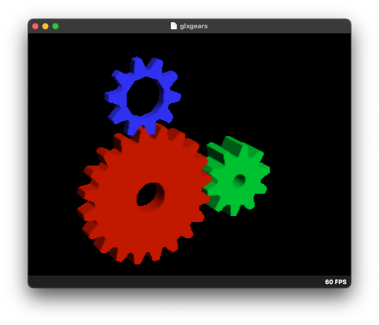

GLXGears 64
--------------

This is a port of GLXGears to the Nintendo 64.



## Reading the Source
The source code is located in the src/ directory. The file gears.c is a slightly modified version of the original GLXGears source code. The file main.c is the main entry point for the N64 ROM and does basic setup of the display.

## Building Instructions

### Requirements:
* Docker
* Git
* Node / NPM
* Make

### 1. Installing libdragon
libdragon is the utitlity used to build the n64 rom as well as providing the toolchain and OpenGL implementation over the RDP.

Run ```npm install -g libdragon``` to install libdragon's CLI tool.

Then, run ```libdragon install``` in the root of the project to install libdragon.

### 2. Building the ROM
Run ```libdragon make``` in the root of the project to build the ROM.
You should then have `glxgears.z64` in the root of the project.